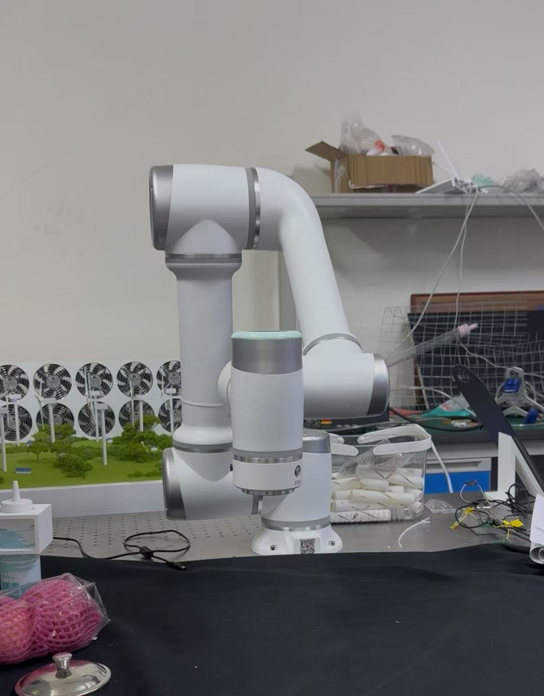
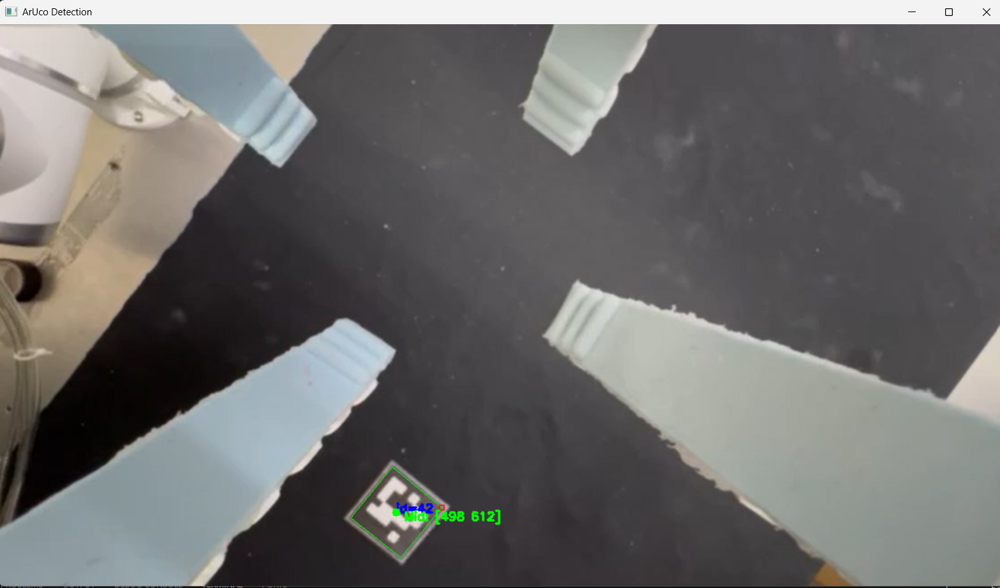

# ArmFramework
Robotic arm control framework adapted to control various robotic arms, such as Elite Robots series and JAKA series. It was used to quickly write routines for experiments and recording demonstrations. 

  
 Here is a demo on the JAKA 5 series robot showcasing the ArUco marker tracking capability. By scaning the position of the ArUco marker, the pinhole camera model formula can be used to calculate the position of the marker assuming it is a flat table since the camera height is provided through the robot.

This works espically when the camera is obstructed, making it difficult to detect the marker at all times

Another way to guarantee the xy position of the robot is through PID feedback, which is guaranteed to work with any height. This is sometimes used for fine tuning. 

Here is a demo with the Elite Robot ec12, and using the framework it can work with a custom coordinate system as well as relative motion and a custom velocity profile, features that are not provided in the original library. 

The main libraries are the transform_lib, visualize_lib, and pid_controllerm. An adaptation of these libraries is included in src for the ec12 robot. 